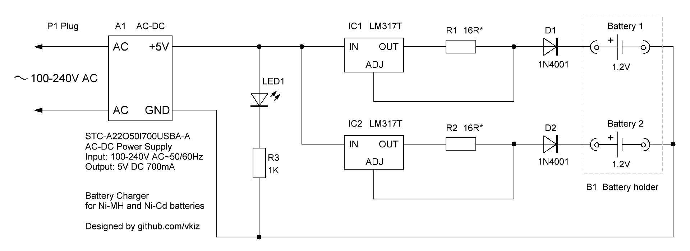

# Battery Charger

A simple dual-cell charger designed for Ni-MH and Ni-Cd batteries (accumulators).

* Trickle charging method
* Galvanic isolation from the mains power supply
* Handles two battery cells simultaneously and independently

## Electronic circuit

The charger uses a trickle charging method. The simplest of the safe charging methods is with a fixed low current equal 0.1*C (where C is the current equivalent to the capacity of the battery divided by one hour). The total charging time is limited to 16 hours.

Icharging = (Vref / R1) + Iadj = 1.25V / R1

| # | Designator | Quantity | Part Number          | Package     | Description                                                               |
| - | ---------- | -------- | -------------------- | ----------- | ------------------------------------------------------------------------- |
| 1 | A1         | 1        | STC‑A22O50I700USBA‑A | 40x25x10mm  | AC-DC Power Supply; Input: 100-240V AC~50/60Hz 200mA; Output: 5V DC 700mA |
| 2 | IC1, IC2   | 2        | LM317T               | TO-220      | Adjustable voltage regulator in current stabilization mode; Vref = 1.25V  |
| 3 | R1, R2     | 2        | CF-1/4W-16RJ         | 0.25W       | Resistor 16 Ohm ±5% (limits charging current to 75 mA for 750 mAh battery |
| 4 | D1, D2     | 2        | 1N4001               | DO-41       | Protection diode, any of 1N4001-1N4007, etc.                              |
| 5 | LED1       | 1        | L-132XHD             | D=3mm       | Any red LED for charging indication                                       |
| 6 | R3         | 1        | CF-1/4W-1KJ          | 0.25W       | Resistor 1K Ohm ±5%                                                       |
| 7 | P1         | 1        | CEE 7/16 Europlug    | Type C      | Two-pole round-pin domestic AC power plug                                 |
| 8 | B1         | 1        | BH-321-2A            | 59x33x15mm  | Battery holder for 2xAA cells (with modified terminals)                   |

## Device design

